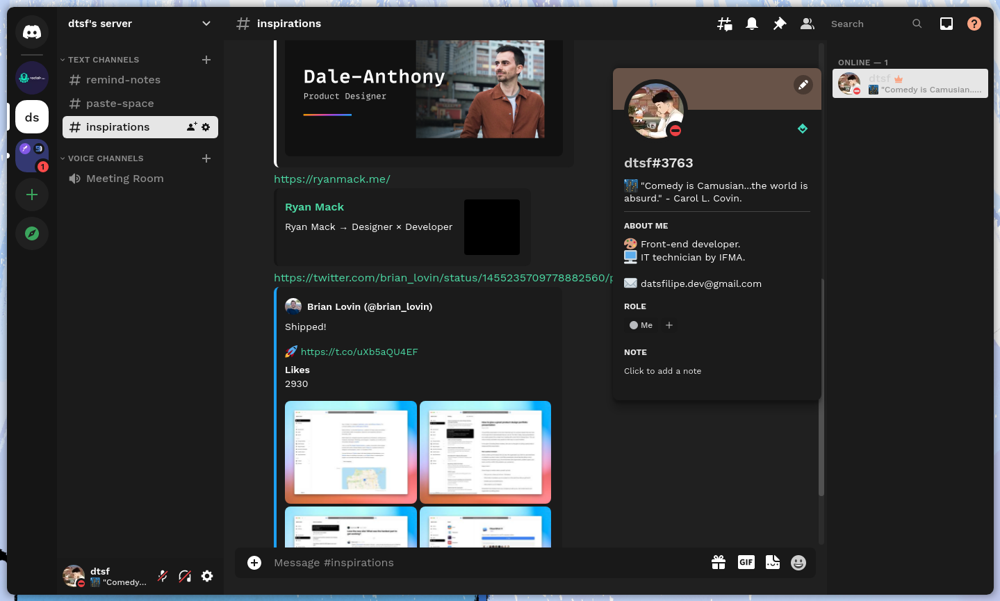

<h1 align="center">
Smooth Theme for BetterDiscord
</h1>

  

## Sponsoring

## Installation

Download the theme navigating to [here](https://raw.githubusercontent.com/datsfilipe/smooth-theme/main/src/theme/smooth.theme.css) and pressing `ctrl + s` or `cmd + s`.

## Contributing

To contribute check the [guide](https://github.com/datsfilipe/smooth-theme/blob/main/contributing.md).

## Preview

  

