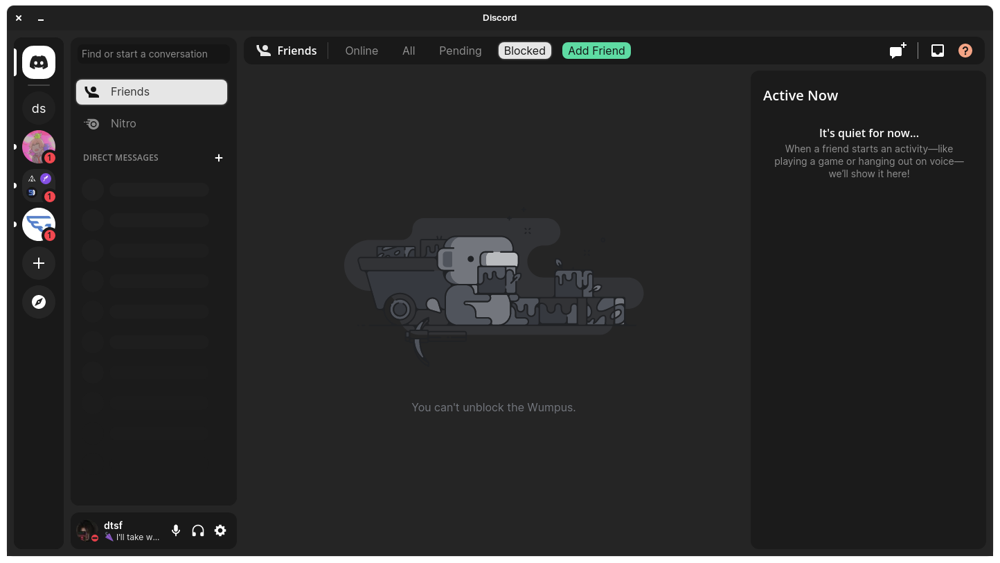
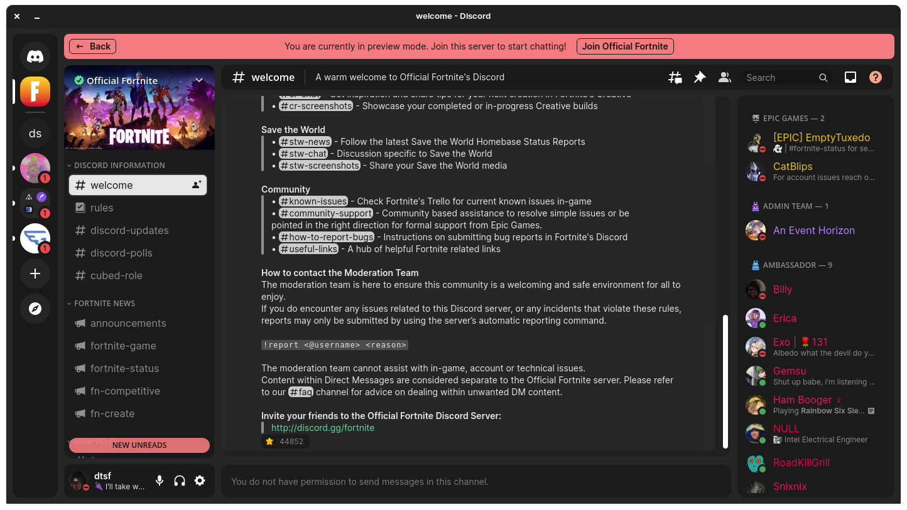
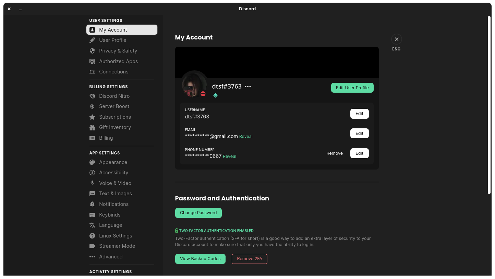
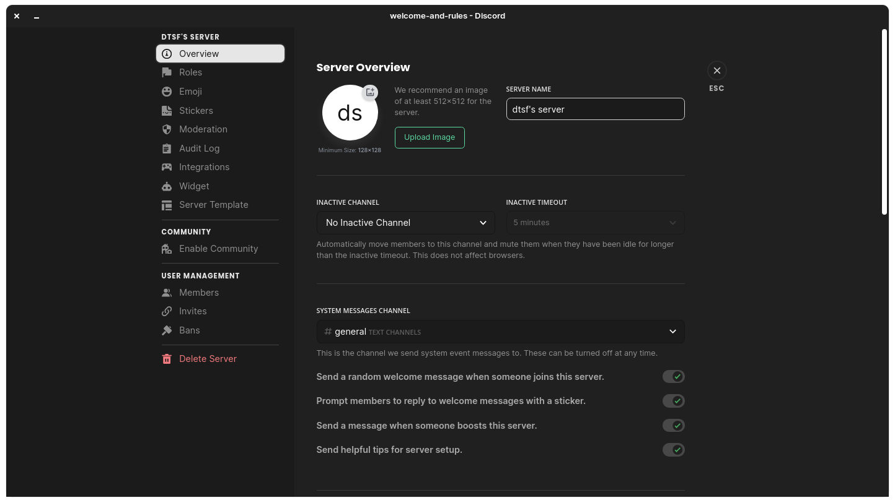

<h1 align="center">
Smooth Theme for BetterDiscord
</h1>

  

# Installation

Download the theme navigating to [here](https://raw.githubusercontent.com/datsfilipe/smooth-theme/main/src/theme/smooth.theme.css) and pressing `ctrl + s` or `cmd + s`.

# Preview

##### **Home**

  

##### **Server Lobby**

  

##### **Settings Screen**

  

##### **Server Settings Screen**

  

##### **More**
Inspired by the [Zorin GTK theme](https://github.com/ZorinOS/zorin-desktop-themes).
